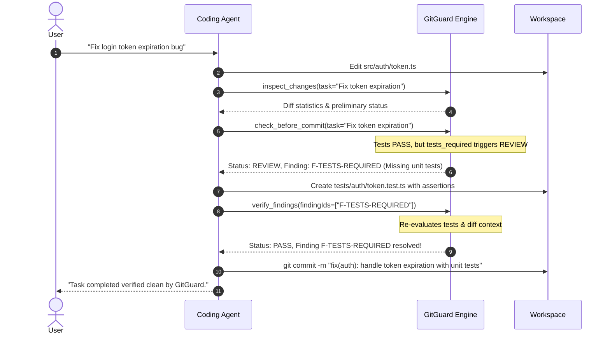

# GitGuard

[](https://github.com/2061863797/GitGuard/actions)
[](https://nodejs.org/)
[](https://www.typescriptlang.org/)
[](https://typesafe.ai/)
[](https://modelcontextprotocol.io/)
[](LICENSE)

> **Repository-aware change verification and quality gate powered by TypeSafe / Jev System One semantic intelligence & deterministic checks.**

GitGuard verifies code changes **before** they are committed, merged, or accepted into a software repository. Combining deterministic toolchains with **TypeSafe / Jev System One** semantic decision models, repository context extraction, and a configurable policy engine, GitGuard acts as an autonomous, high-precision verification infrastructure for both human developers and AI coding agents.

## 先用起来

在本仓库源码目录运行以下命令，先确认 CLI 可用：

```bash
pnpm install --frozen-lockfile
pnpm gitguard inspect --cwd .
pnpm gitguard check --offline --cwd .
```

`inspect` 显示选中范围的改动；`check --offline` 不需要 API 密钥；选中范围有改动时，会按仓库配置执行测试、lint 和类型检查。若仓库没有待检查的改动，`PASS` 只表示当前范围为空。检查另一个项目时，把 `--cwd .` 换成该项目路径，并先确认其检查命令。完整的安装、检查、结果解读和排障步骤见 **[中文版快速上手](docs/quickstart.zh-CN.md)**。

**安装提示：** [npm 上同名的 `gitguard` 包](https://www.npmjs.com/package/gitguard)当前是另一个提交信息检查工具。要使用本仓库代码，请按上面的源码命令运行；不要执行 `pnpm add -D gitguard` 来安装本项目。

---

### 🌟 Powered by TypeSafe / Jev (System One AI)

At the core of GitGuard's semantic gate is **[TypeSafe](https://typesafe.ai/) and its System One foundation model, Jev**. 

Unlike conversational LLMs that produce verbose, unstructured code review opinions prone to hallucinations, **TypeSafe / Jev** turns complex code diffs, task intents, and repository contexts into **typed, calibrated judgments and mathematical probabilities**:

- 🎯 **Task Fulfillment (`task_completed`)**: Calibrates whether the diff genuinely accomplishes the declared goal or merely wrote superficial, hallucinated code.
- 🛡️ **Scope Creep & Boundary Drift (`unrelated_changes`)**: Mathematically detects modifications that deviate from the user's intent or touch files outside the task scope.
- 🧪 **Test Requirement Assessment (`tests_required`)**: Programmatically assesses whether new logic or edge paths demand corresponding unit or integration tests.
- 🔒 **Security Sensitivity Assessment (`security_sensitive`)**: Evaluates whether auth flows, cryptographic primitives, or credential paths have been altered.
- ⚠️ **Regression Risk Forecasting (`regression_risk`)**: Quantifies blast radius and categorizes regression likelihood into discrete risk levels (`low`, `medium`, `high`, `critical`).
- ⚡ **Offline Mode Without an API Key**: Uses a local heuristic mock provider for semantic signals when `--offline` is selected.

---

## Table of Contents

- [中文版快速上手](docs/quickstart.zh-CN.md)
- [Why GitGuard?](#why-gitguard)
- [Architecture & Overview](#architecture--overview)
- [Core Concepts](#core-concepts)
- [Prerequisites & Installation](#prerequisites--installation)
- [Developer Quickstart (CLI)](#developer-quickstart-cli)
- [Coding Agent Autonomous Workflow](#coding-agent-autonomous-workflow)
- [MCP Server Setup](#mcp-server-setup)
- [CI/CD Integration (GitHub Actions)](#cicd-integration-github-actions)
- [Configuration Reference (`.gitguard.yml`)](#configuration-reference-gitguardyml)
- [Security & Privacy Model](#security--privacy-model)
- [Development & Verification](#development--verification)
- [License](#license)

---

## Why GitGuard?

Traditional linters, typecheckers, and test runners answer only basic deterministic questions:
- *Does the code compile without syntax errors?*
- *Do existing regression tests pass?*

However, in modern workflows driven by autonomous coding agents (Claude Code, Cursor Composer, Windsurf, Aider, Antigravity), code changes often introduce subtle, high-impact defects that pass static analysis:
- **Did the agent actually fulfill the requested task**, or did it write superficial code?
- **Did the agent introduce unintended scope creep**, refactoring unrelated files or modifying configurations outside its charter?
- **Are critical behavioral changes missing automated tests?**
- **Were security-sensitive boundaries silently altered?**
- **Were API keys or private credentials accidentally committed into diff hunks?**

GitGuard bridges this gap. It does not write or generate code. Its Git inspection is read-only; configured test, lint and typecheck commands can write files according to the target repository's scripts. The verification loop is:

$$\text{Agent / Developer} \longrightarrow \text{Modify Code} \longrightarrow \text{GitGuard Inspect \& Check} \longrightarrow \text{Structured Findings} \longrightarrow \text{Remediate} \longrightarrow \text{GitGuard Verify} \longrightarrow \text{PASS}$$

---

## Architecture & Overview

GitGuard decouples interface adapters from the central verification engine. All clients—whether human developers running CLI commands, AI agents connected via the Model Context Protocol (MCP), Git pre-commit hooks, or CI pipelines—execute the exact same verification pipeline.

```
┌────────────────────────────────────────────────────────────────────────┐
│                          EXTERNAL CLIENTS                              │
├──────────────────┬─────────────────────────┬───────────────────────────┤
│ Human Developer  │  Autonomous AI Agent    │  Continuous Integration   │
│  (Terminal / CLI)│   (Claude / Cursor MCP) │   (GitHub Actions / CI)   │
└─────────┬────────┴────────────┬────────────┴─────────────┬─────────────┘
          │                     │                          │
          ▼                     ▼                          ▼
┌────────────────────────────────────────────────────────────────────────┐
│                          INTERFACE LAYER                               │
├──────────────────┬─────────────────────────┬───────────────────────────┤
│ gitguard CLI     │  GitGuard MCP Server    │  CI Exit Code & Reporter  │
│ (inspect/check)  │  (stdio JSON-RPC tools) │  (0 = PASS/WARN, 1 = BLOCK)
└─────────┬────────┴────────────┬────────────┴─────────────┬─────────────┘
          │                     │                          │
          └─────────────────────┼──────────────────────────┘
                                ▼
┌────────────────────────────────────────────────────────────────────────┐
│                        GITGUARD CORE ENGINE                            │
├────────────────────────────────────────────────────────────────────────┤
│ • Git Read Adapter: Safe, read-only extraction of working/staged state │
│ • Context Builder: Diff parsing, Hunk-adjacent source context, test discovery │
│ • Policy Engine: Rule evaluation, threshold matching, gate synthesis   │
│ • Finding Manager: SHA-256 fingerprinting, evidence requirements       │
│ • Gate Verifier: Closed-loop resolution confirmation                   │
└──────────────────┬─────────────────────────┬───────────────────────────┘
                   │                         │
                   ▼                         ▼
┌──────────────────────────────────┐  ┌──────────────────────────────────┐
│       DETERMINISTIC LAYER        │  │     SEMANTIC DECISION LAYER      │
├──────────────────────────────────┤  ├──────────────────────────────────┤
│ • Safe Subprocess Runner (No Sh) │  │ • TypeSafe / Jev System One      │
│ • pnpm test / vitest runner      │  │ • Calibrated Probability Output  │
│ • pnpm lint / ESLint / tsc       │  │ • 5 Standard Quality Questions   │
│ • Real-time Diff Secret Scanner  │  │ • Custom Repository Rules        │
│ • Exit Code Verification         │  │ • Offline / Mock Graceful Fallback│
└──────────────────────────────────┘  └──────────────────────────────────┘
```

---

## Core Concepts

### 1. Changeset
A normalized representation of git modifications. GitGuard inspects multiple scopes without mutating the repository:
- `staged`: Only changes staged in the git index (`git add`).
- `working`: Only unstaged modifications in the working tree.
- `all` (default): Combined staged and unstaged working modifications.
- `commit`: Changes introduced by a specific commit ref (e.g. `HEAD`).
- `range`: Diff between two commit references or branches (e.g. `main..feature`).

### 2. EvaluationContext
The structured payload compiled by the Context Builder containing:
- Unified diff hunks with per-file additions and deletions.
- **Surrounding source lines** (default 40 lines) providing context around changed blocks.
- **Discovered related tests** co-located in the repository.
- **Repository instructions** detected in root/monorepo documentation (e.g., `AGENTS.md`, `CONTRIBUTING.md`).
- Declared **task intent statement**.

### 3. Deterministic Layer
Executes concrete, verifiable tools directly in the workspace:
- Command sandbox preventing shell metacharacter injection.
- Zero-tolerance diff secret scanner detecting AWS keys, GitHub tokens, OpenAI secrets, private keys, and JWTs.
- Automatic credential redaction (`***[REDACTED]***`) in logs, findings, and context.

### 4. Semantic Decision Layer
Unlike generative LLMs that write unstructured code reviews, GitGuard utilizes **System One decisions** (via TypeSafe / Jev):
- Discrete, programmatic questions evaluated into calibrated probabilities $[0.0, 1.0]$ or categorical risk levels (`low`, `medium`, `high`, `critical`).
- Zero hallucination: decisions map directly to numerical thresholds configured in `.gitguard.yml`.
- Robust offline fallback (`--offline` or mock provider) guarantees deterministic execution when external model credentials are unavailable.

### 5. Policy Engine & Gate Verdicts
The Policy Engine evaluates deterministic violations and semantic signals against `.gitguard.yml` rules. Verdicts adhere to the worst-case hierarchy:

$$\text{BLOCK} > \text{REVIEW} > \text{WARN} > \text{PASS}$$

| Verdict | Meaning | Default Exit Code | Agent Action |
|:---|:---|:---:|:---|
| **`PASS`** | Clean changeset. All tests, rules, and semantic checks satisfied. | `0` | Proceed to commit / merge. |
| **`WARN`** | Minor advisory signals detected (e.g., small diff drift). | `0` | Review advisory, commit permitted. |
| **`REVIEW`** | Meaningful risk detected (e.g., missing tests, auth changes). | `0` (or `1` with `--strict`) | Agent or human review recommended. |
| **`BLOCK`** | Hard failure (failing test, compilation error, hardcoded secret). | `1` | **Blocked.** Commit/merge rejected until fixed. |

### 6. Structured Finding System
Every rule violation produces a structured `Finding`:
- **Finding ID**: Human-readable identifier (e.g., `F-DETERMINISTIC-SECRET-4A7B`).
- **Fingerprint**: Stable SHA-256 hash derived from rule ID and normalized affected file paths. Survives line edits.
- **Severity**: `INFO`, `WARN`, `ERROR`, `CRITICAL`.
- **Expected Evidence**: Explicit remediation instructions enabling autonomous agents to know *exactly* what action is required to resolve the finding.
- **Lifecycle**: Transitions from `ACTIVE` $\rightarrow$ `RESOLVED` (confirmed by `verify`) or `SUPPRESSED`.

---

## Prerequisites & Installation

- Node.js 20+、Git 2.30+、pnpm 9+。
- 在 GitGuard 源码目录运行 `pnpm install --frozen-lockfile`。
- `pnpm gitguard --help` 直接运行源码，无需先构建；`node bin/gitguard.js` 和 MCP 客户端需要先运行 `pnpm build`。

npm 上的同名包不对应本仓库源码。当前请使用本仓库的 `pnpm gitguard` 脚本；向其他项目传入 `--cwd` 指定要检查的 Git 仓库。详见 [逐步操作与常见问题](docs/quickstart.zh-CN.md)。

---

## Developer Quickstart (CLI)

以下命令从 **GitGuard 源码目录**运行。将 `../my-project` 换成目标 Git 仓库路径；如果路径包含空格，请加引号。

```bash
# 1. 先看当前有哪些改动
pnpm gitguard inspect --cwd ../my-project

# 2. 只看已暂存的改动
pnpm gitguard inspect --staged --cwd ../my-project

# 3. 对已暂存改动运行本地质量门禁；不需要 API 密钥
pnpm gitguard check --offline --staged --task "修复登录超时" --cwd ../my-project

# 4. 根据检查输出中的 finding ID 查看并复查问题
pnpm gitguard findings --cwd ../my-project
pnpm gitguard verify --offline --findings GG-001 --cwd ../my-project
```

最后一条的 `GG-001` 是示例，请替换为 `findings` 实际输出的 ID。选中范围有改动时，`check` 会运行目标仓库配置的测试、lint 和类型检查；没有配置时，使用 `pnpm test`、`pnpm lint` 和 `pnpm tsc --noEmit`。其他技术栈应先修改目标仓库的 `.gitguard.yml`，示例见[快速上手](docs/quickstart.zh-CN.md#3-运行质量门禁)。

常用范围：`--staged` 为已暂存，`--working` 为未暂存，缺省为全部未提交改动；`inspect --target HEAD` 可检查最近一次提交。`--json` 输出结构化结果，`--strict` 让 `WARN`/`REVIEW` 返回非零退出码。在线语义检查需设置 `TYPESAFE_API_KEY`，首次使用建议从 `--offline` 开始。

---

## Coding Agent Autonomous Workflow

GitGuard is engineered specifically as a verification harness for autonomous AI coding agents. Agents execute an iterative **Inspect → Fix → Verify** loop:



### Step-by-Step Agent Implementation Guide
1. **Receive Prompt**: The agent parses user requirements into a concise `task` string.
2. **Execute Edits**: The agent modifies or creates code files.
3. **Inspect Changes**: Call `inspect_changes` to review diff hunks, affected files, and catch accidental secret leakage immediately.
4. **Pre-Commit Verification**: Call `check_before_commit` with the `task` description.
5. **Inspect Findings**: If verdict is `WARN`, `REVIEW`, or `BLOCK`, the agent reads `finding.expectedEvidence` to understand required fixes.
6. **Remediate**: The agent applies fixes (e.g. adding missing tests, reverting extraneous refactors, removing sensitive tokens).
7. **Verify**: Call `verify_findings` with the finding IDs.
8. **Clean Commit**: Once verdict reaches `PASS`, the agent commits or creates a PR with complete confidence.

---

## MCP Server Setup

GitGuard provides a native MCP server implementing the [Model Context Protocol](https://modelcontextprotocol.io/) specification over standard I/O (`stdio`).

### Registered MCP Tools

| Tool Name | Parameters | Description |
|:---|:---|:---|
| **`inspect_changes`** | `scope`, `target`, `task`, `cwd` | Read-only inspection of diffs, modified files, line counts, and preliminary findings. |
| **`check_task_completion`** | `task` (required), `scope`, `cwd` | Evaluates task fulfillment probability and flags unrelated diff drift. |
| **`check_before_commit`** | `task`, `scope`, `cwd` | Full quality gate check combining tests, linting, secrets, and policy rules. |
| **`verify_findings`** | `findingIds` (required), `task`, `cwd` | Closed-loop verification confirming remediation of reported finding IDs. |

### Protocol Hygiene Notice
GitGuard strictly preserves the MCP stdio protocol. **Zero diagnostic messages are ever printed to `stdout`**. All diagnostic or debug output is routed strictly to `stderr` via `--debug`.

### 客户端配置示例

先在 GitGuard 源码目录执行 `pnpm build`。在 MCP 客户端中配置 Node.js 启动 **本仓库的绝对路径**；下面是 Windows JSON 路径示例，其他系统请换成自己的绝对路径：

```json
{
  "mcpServers": {
    "gitguard": {
      "command": "node",
      "args": ["C:\\path\\to\\GitGuard\\bin\\gitguard.js", "mcp"]
    }
  }
}
```

将该 `mcpServers` 项放入客户端的 MCP 配置文件。需要真实 TypeSafe 语义判断时，在客户端安全地配置 `TYPESAFE_API_KEY` 环境变量。不要把相对路径 `bin/gitguard.js` 直接复制到另一个项目的配置中。

---

## CI/CD Integration (GitHub Actions)

本仓库实际运行的 CI 配置是 [`.github/workflows/ci.yml`](https://github.com/2061863797/GitGuard/blob/main/.github/workflows/ci.yml)，会执行 lint、源码类型检查、构建、全量测试和打包安装测试。要在其他仓库使用 GitGuard，请先按[快速上手](docs/quickstart.zh-CN.md)确认本地命令与目标仓库的 `.gitguard.yml` 检查命令，再将同一命令接入其 CI。不要直接复制本仓库的 `pnpm gitguard` 脚本到没有 GitGuard 源码的项目。

---

## Configuration Reference (`.gitguard.yml`)

The complete reference schema for `.gitguard.yml`:

```yaml
version: 1
```

### `context` (Object)
Controls the extraction budget and AST context parameters for diff analysis:

| Key | Type | Default | Description |
|:---|:---|:---:|:---|
| `max_diff_chars` | `number` | `50000` | Character limit for unified diffs before intelligent truncation. |
| `max_total_chars` | `number` | `100000` | Absolute upper bound on character size for the synthesized evaluation context. |
| `surrounding_lines` | `number` | `40` | Number of surrounding lines of source code included around diff hunks. |
| `related_tests.max_files` | `number` | `5` | Maximum number of co-located test files discovered and attached to context. |
| `instructions.max_chars` | `number` | `15000` | Character budget for repository guideline documents (`AGENTS.md`, etc.). |

### `system_one` (Object)
Configures the semantic judgment provider:

| Key | Type | Default | Description |
|:---|:---|:---:|:---|
| `provider` | `string` | `'typesafe'` | Provider name: `'typesafe'` (live System One) or `'mock'` (offline simulation). |
| `model` | `string` | `'jev-latest'` | Identifier of the underlying semantic evaluator model (official recommended default). |
| `timeout_ms` | `number` | `10000` | Maximum network wait time (ms) for model responses. |
| `baseUrl` | `string` | `'https://api.typesafe.ai/v1'` | Repository configuration accepts only official TypeSafe URLs unless the caller explicitly sets `--allow-custom-provider`. |

### `deterministic` (Object)
Configures concrete tool checks executed as isolated subprocesses:

| Key | Type | Default | Description |
|:---|:---|:---:|:---|
| `test.enabled` | `boolean` | `true` | Enables or disables automated test execution. |
| `test.run` | `string` | `'pnpm test'` | Test execution command. |
| `test.block_on_failure` | `boolean` | `true` | When `true`, test failure immediately sets gate status to `BLOCK`. |
| `test.timeout_ms` | `number` | `60000` | Maximum execution time in milliseconds before terminating the test runner. |
| `lint.enabled` | `boolean` | `true` | Enables or disables the static linter. |
| `lint.run` | `string` | `'pnpm lint'` | Linter execution command. |
| `typecheck.enabled` | `boolean` | `true` | Enables or disables static type checking. |
| `typecheck.run` | `string` | `'pnpm tsc --noEmit'` | Typecheck compiler command. |
| `secret_scan.enabled` | `boolean` | `true` | Enables real-time regex secret detection on added diff lines. |
| `secret_scan.block_on_detection` | `boolean` | `true` | Immediate `BLOCK` verdict when unredacted credentials are discovered. |
| `secret_scan.patterns` | `string[]` | `[]` | Extra regex patterns. For safety, patterns may use literals, character classes, anchors, escapes and exact repetitions up to `{128}`; groups, alternation and variable repetitions are rejected. |

### `rules` (Object)
Configures standard built-in semantic decision rules and thresholds:

| Rule Key | Threshold Properties | Default | Rationale |
|:---|:---|:---:|:---|
| `task_completed` | `review_below`, `block_below` | `< 0.60` (REVIEW), `< 0.20` (BLOCK) | Inverted: triggers violation if completion confidence is *lower* than threshold. |
| `unrelated_changes` | `warn`, `review`, `block` | `0.55`, `0.75`, `0.95` | Triggers when changes diverge from declared task intent. |
| `tests_required` | `warn`, `review` | `0.60`, `0.80` | Triggers when functional modifications lack automated tests. |
| `security_sensitive` | `warn`, `review`, `block` | `0.50`, `0.65`, `0.90` | Triggers on modifications touching security-critical code paths. |
| `regression_risk` | `warn_on`, `review_on`, `block_on` | `['medium']`, `['high']`, `['critical']` | Evaluates blast radius and likelihood of introducing bugs. |

### `custom_rules` (Array of Objects)
Defines project-specific semantic rules evaluated against matching files:

| Property | Type | Description |
|:---|:---|:---:|
| `id` | `string` | Unique identifier (e.g., `auth_requires_tests`). |
| `description` | `string` | Human-readable explanation of rule purpose. |
| `files` | `string[]` | Array of glob patterns defining target file scope (e.g., `["src/auth/**"]`). |
| `exclude` | `string[]` | Array of glob patterns excluded from evaluation (e.g., `["**/*.test.ts"]`). |
| `question` | `string` | Precise natural language prompt evaluated by System One. |
| `primitive` | `string` | Primitive evaluation type: `'noul'` (probability), `'boolean'`, `'choice'`, or `'score'`. |
| `warn`, `review`, `block` | `number` | Probability thresholds triggering respective verdicts. |

### `privacy` (Object)
Data sanitization and privacy controls:

| Key | Type | Default | Description |
|:---|:---|:---:|:---|
| `redact_secrets` | `boolean` | `true` | Replaces detected credentials with `***[REDACTED]***` before logging or model calls. |
| `include_full_files` | `boolean` | `false` | Restricts context to diff hunks and surrounding spans rather than whole files. |
| `exclude_paths` | `string[]` | `['.env*', '*.pem', '*.key', ...]` | File patterns entirely excluded from diff extraction and context. |

Repository configuration cannot set `redact_secrets: false` or `include_full_files: true`.

### `gate` (Object)
Operational gate behavior:

| Key | Type | Default | Description |
|:---|:---|:---:|:---|
| `block_on` | `string[]` | `['BLOCK']` | Verdict levels producing a non-zero exit code. Add `'REVIEW'` or `'WARN'` for strict enforcement. |
| `cache.enabled` | `boolean` | `true` | Enables diff-hash verification caching to accelerate repeat runs. |
| `cache.directory` | `string` | `'.git/gitguard/cache'` | Directory where verification cache entries are stored. |

---

## Security & Privacy Model

GitGuard is built with defense-in-depth principles:

1. **Read-Only Git Inspection**: Git inspection avoids mutating staging and commits. Configured test, lint and typecheck commands run in the target repository and may write files according to those scripts.
2. **Dual Evaluation Contexts**: Complete separation between `RawRepositoryContext` (used by local deterministic checks to catch hardcoded secrets in `.env` and diffs) and `SemanticEvaluationContext` (sanitized and redacted before sending to external AI models).
3. **Command Sandbox**: Subprocesses run through `execFile` without shell interpolation (`shell: false`), disallowing command chaining (`&&`, `;`, `|`), redirection, or shell metacharacter injection.
4. **Prompt Injection Mitigation**: Evaluation questions use typed primitives (`noul`, `choice`, `score`) with explicit instructions rather than free-form unconstrained prompts, preventing diff contents from hijacking verification results.

For complete details on our threat model and security boundaries, see [SECURITY.md](SECURITY.md).

---

## Development & Verification

### Running the Test Suite
The repository includes a comprehensive test suite covering unit tests, stress suites, adversarial edge cases, and CLI/MCP integration:

```bash
# Run full Vitest suite
pnpm test

# Run unit tests only
pnpm test:unit

# Run end-to-end tests
pnpm test:e2e

# Run with test coverage reporting
pnpm test:coverage
```

### Lint, TypeScript Compilation & Typecheck
```bash
# Lint source, tests, CLI and scripts
pnpm lint

# Typecheck production source
pnpm typecheck

# Full production build to dist/
pnpm build
```

---

## License

GitGuard is licensed under the [Apache-2.0 License](LICENSE).
